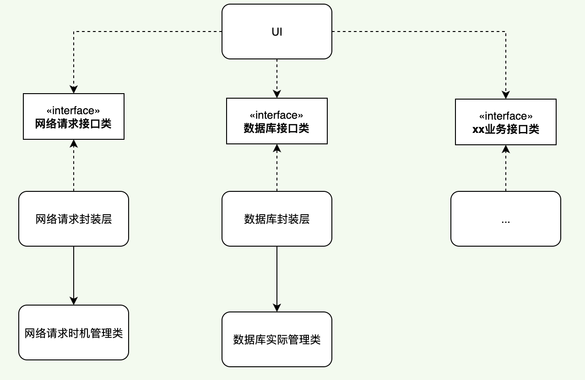

<!--
 * @Author: hfqf123@126.com
 * @Date: 2023-01-09 08:38:46
 * @LastEditors: user.email
 * @LastEditTime: 2023-01-31 16:24:58
 * @FilePath: /design-pattern/app设计规范/软件设计原则(SOLID)/依赖倒置原则(DIP)/README.md
 * @Description: 
 * 
 * Copyright (c) 2023 by hfqf123@126.com, All Rights Reserved. 
-->
# 依赖倒置原则

### **介绍**
依赖倒置原则（Dependence Inversion Principle，DIP）是指设计代码结构时，高层模块不应该依赖低层模块，二者都应该依赖其抽象。即面向接口编程。

抽象不应该依赖细节，细节应该依赖抽象。通过依赖倒置，可以减少类与类之间的耦合性，提高系统的稳定性，提高代码的可读性和可维护性，并且能够降低修改程序所造成的风险。

### **问题来源**
随着业务的扩展，增加功能就需要从底层实现到高层调用依次地修改代码。

### **优化示例**

1.一般做法

2.优化后

>可以看到当使用依赖倒置后，依赖关系由之前的UI层->封装层->实际管理类，变成了UI层->业务接口类和封装层->业务接口层。UI层可以就看作是个容器，其它功能的添加类似插件方式，调用者和实现者解耦。

### **优点**

1.不同模块解藕。

2.有效减小控制变动影响范围。

3.可形成插件化开发思路 

>总结一下：1.面向接口编程 2.插件化

### **参与贡献**

1.  hfqf123@126.com
