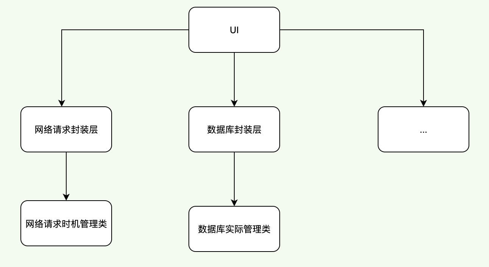

<!--
 * @Author: hfqf123@126.com
 * @Date: 2023-01-09 08:38:46
 * @LastEditors: user.email
 * @LastEditTime: 2023-01-30 19:48:49
 * @FilePath: /软设流程图/app设计规范/软件设计原则(SOLID)/依赖倒置原则(DIP)/README.md
 * @Description: 
 * 
 * Copyright (c) 2023 by hfqf123@126.com, All Rights Reserved. 
-->
# 依赖倒置原则

### **介绍**
依赖倒置原则（Dependence Inversion Principle，DIP）是指设计代码结构时，高层模块不应该依赖低层模块，二者都应该依赖其抽象。即面向接口编程。

抽象不应该依赖细节，细节应该依赖抽象。通过依赖倒置，可以减少类与类之间的耦合性，提高系统的稳定性，提高代码的可读性和可维护性，并且能够降低修改程序所造成的风险。

### **问题来源**
随着业务的扩展，增加功能就需要从底层实现到高层调用依次地修改代码。

### **优化示例**

1.一般做法

存在的问题是

2.优化后

### **优点**

1.降低类的复杂度，一个类只负责一个职责。这样写出来的代码逻辑肯定要比负责多项职责简单得多。

2.提高类的可读性，提高系统的可维护性。

3.降低变更引起的风险。变更是必然的，如果单一职责原则遵守得好，当修改一个功能的时候可以显著降低对其他功能的影响。

>需要说明的一点是，单一职责原则不只是面向对象编程思想所特有的，只要是模块化的程序设计，都适用单一职责原则。比如说单一职责原则不仅仅适用于类，还适用于方法。

### **参与贡献**

1.  hfqf123@126.com
