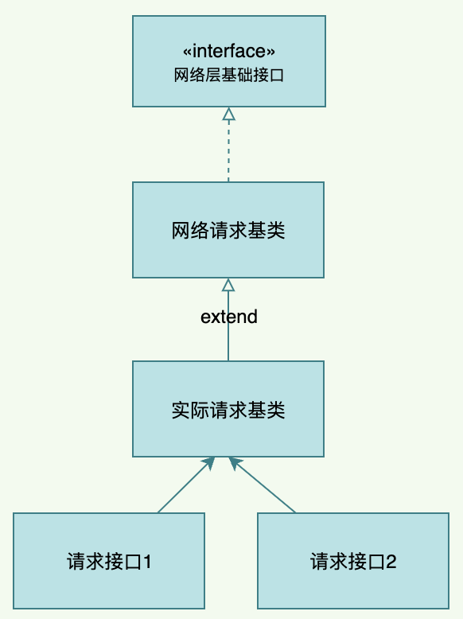
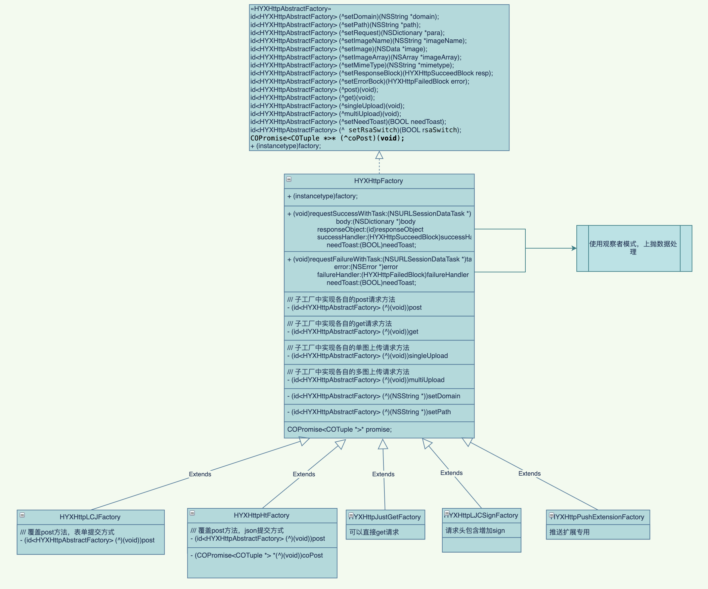

<!--
 * @Author: hfqf123@126.com
 * @Date: 2023-01-09 08:38:46
 * @LastEditors: user.email
 * @LastEditTime: 2023-01-31 18:03:08
 * @FilePath: /design-pattern/app设计规范/软件设计原则(SOLID)/开放封闭原则(OCP)/README.md
 * @Description: 
 * 
 * Copyright (c) 2023 by hfqf123@126.com, All Rights Reserved. 
-->
# 开放封闭原则

### **介绍**
开放封闭原则(Open-Closed Principle)是指：一个软件实体应当对扩展开放(open)，则修改关闭(不修改原来的代码这就是closed)。
* 对扩展开放，意味着有新的需求或变化时，可以对现有代码进行扩展，以适应新的情况。
* 对修改封闭，意味着一旦设计完成，就可以独立完成其工作，而不要对类进行任何修改。

### **问题来源**

某些重要功能可能被多层继承，多处使用。如果没有控制好，某次修改了基类代码，但是测试覆盖范围不够，导致影响其他模块。

### **优化示例**

1.一般做法

2.优化后

>开发封闭原则是让类依赖于固定的抽象，所以对修改就是封闭的；而通过面向对象的继承和多态机制，可以实现对抽象体的继承，通过覆写其方法来改变固有行为，实现新的扩展方法，所以对于扩展就是开放的。这是实施开放-封闭原则的基本思路。
### **优点**

1.通过扩展已有的软件系统，可以提供新的行为,以满足对软件的新需求。

2.已有的软件模块，特别是最重要的抽象模块不能再修改，保持软件系统稳定性。

### **参与贡献**

1.  hfqf123@126.com
