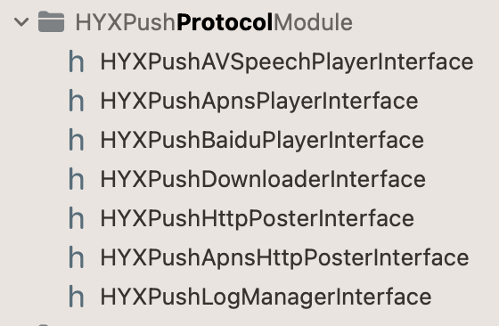

<!--
 * @Author: hfqf123@126.com
 * @Date: 2023-01-09 08:38:46
 * @LastEditors: hfqf123@126.com
 * @LastEditTime: 2023-01-31 18:41:14
 * @FilePath: /design-pattern/app设计规范/软件设计原则(SOLID)/接口隔离原则(ISP)/README.md
 * @Description: 
 * 
 * Copyright (c) 2023 by hfqf123@126.com, All Rights Reserved. 
-->
# 接口隔离原则

### **介绍**
接口隔离原则（Interface Segregation Principle, ISP）是指用多个专门的接口，而不使用单一的总接口，调用者尽量不去依赖需要的接口。
 * 接口类(服务)暴露时尽量内敛，不相关的拆成多个接口类。
 * 调用者按照实际需要依赖所需接口。

### **问题来源**
当接口类(服务)暴露过多接口或者划分不好，会导致自身功能耦合，且影响使用者的按需使用。
### **优化示例**

1.修改前
```
///  跨模块调用注册的方法
@protocol HYXPushAndPlayModuleService <NSObject>

@property (nonatomic, copy) HYXPushAndPlayManagerDownloadDidStartSpeechUtteranceBlock _Nullable  startSpeechUtteranceBlock;

@property (nonatomic, copy) HYXPushAndPlayManagerDownloaddidFinishSpeechUtteranceBlock _Nullable finishSpeechUtteranceBlock;

@property (nonatomic,strong) NSMutableDictionary * _Nullable downLoadHistoryDictionary;

//@property (nonatomic,strong) AFURLSessionManager * _Nullable manager;

@property (nonatomic,strong) NSString  * _Nullable fileHistoryPath;

@property (nonatomic, assign) float originalVoiceValue;

@required

- (void)initJPush;

- (void)initGPush;

- (void)verifyDownloadStates;

- (BOOL)needDownLoadVersion;

- (void)startDownload:(HYXPushAndPlayManagerDownloadingBlock _Nullable)progeressBlock
               failed:(HYXPushAndPlayManagerDownloadFailedBlock _Nullable)failedBlock
                unZip:(HYXPushAndPlayManagerDownloadUnZipBlock _Nullable)unZipBlock;


// 删除离线语音包
- (BOOL)_deleteVoiceFiles;

// 解压zip
- (void)_unZipFileWithFile:(NSURL * _Nullable)fileUrlPath unZip:(HYXPushAndPlayManagerDownloadUnZipBlock _Nullable)unZipBlock;

#pragma mark - 自检

- (void)playCustomMsg:(NSString* _Nullable)msg;

- (void)readContent:(NSString* _Nullable)str msgId:(NSString *)msgId;

- (void)adjustVoice;

/// 是否应该调整语音
- (BOOL)shouldAdjustVoice;

- (BOOL)backgroundMode;

- (NSURLSessionDownloadTask  * _Nullable)AFDownLoadFileWithUrl:(NSString* _Nullable)urlHost
                                            progress:(DowningProgress _Nullable)progress
                                        fileLocalUrl:(NSURL * _Nullable)localUrl
                                             success:(DonwLoadSuccessBlock _Nullable)success
                                             failure:(DownLoadfailBlock _Nullable)failure;

/** 停止所有的下载任务*/
- (void)stopAllDownLoadTasks;

#pragma mark - 推送extension

- (HYXPushNoticeSoundType)soundType;

- (HYXPushNoticeSoundType)testSoundType;

- (BOOL)_needBaiduSound;

- (BOOL)_needNormalSound;

- (void)setSoundType:(HYXPushNoticeSoundType)soundType;

- (void)setTestSoundType:(HYXPushNoticeSoundType)testSoundType;

- (HYXPushSoundDownStatus)downStatus;

- (void)badgePlusOne;
    
- (NSNumber * _Nullable)currentBadge;

- (UNNotificationSound *_Nullable)_normalSound:(UNMutableNotificationContent * _Nullable)bestAttemptContent  API_AVAILABLE(ios(10.0));

- (BOOL)voiceSwitchOpen;

- (HYXPushType)pushType:(NSString * _Nullable)msgType;

- (void)startPlayContentVoice:(NSString * _Nonnull)willReadContent
           bestAttemptContent:(UNMutableNotificationContent * _Nonnull)bestAttemptContent
               contentHandler:(void (^_Nullable)(UNNotificationContent * _Nonnull))contentHandler API_AVAILABLE(ios(10.0));

- (void)setApnsSound:(UNMutableNotificationContent * _Nonnull)bestAttemptContent
      contentHandler:(void (^_Nonnull)(UNNotificationContent * _Nonnull))contentHandler API_AVAILABLE(ios(10.0));

- (void)_readByBaiduWith:(NSString * _Nonnull)str;

- (void)didEndExtention:(UNMutableNotificationContent * _Nonnull)bestAttemptContent
         contentHandler:(void (^_Nonnull)(UNNotificationContent * _Nonnull))contentHandler  API_AVAILABLE(ios(10.0));

#pragma mark - 工具类
- (NSString * _Nullable)amountBySubtitle:(NSString * _Nullable)subtitle;

- (NSString * _Nullable)staticOnePointStringBySubtitle:(NSString * _Nullable)subtitle;

- (NSString * _Nullable)staticStringBySubtitle:(NSString * _Nullable)subtitle;

// 保留一位小数
- (NSString * _Nullable)onePointformatFloat:(NSString *_Nullable )amount;

// 获取2个字符 之间的文字
- (NSString * _Nullable)subString:(NSString * _Nullable)string from:(NSString * _Nullable)startString to:(NSString * _Nullable)endString;

- (BOOL)needVoiceAlert:(NSString * _Nullable)sjlx isLogin:(NSString *_Nullable)isLogin;

/// 开始下载tts文件
/// @param text 要播报的文字
- (void)downloadMp3ThenRead:(NSString * _Nullable)text;

/// 超过5min的消息不播报
/// @param sendTime sendTime
- (BOOL)ingoreForOldMsg:(NSString * _Nullable)sendTime;

/// 上传推送信息
/// @param apns apns
- (void)uploadApnsMsg:(NSDictionary * _Nullable)apns;

#pragma mark - 后台保活

/// app是否处于活跃中
/// @param active active
- (void)setAppState:(BOOL)active;

/// 当前app是否处于活跃中
- (BOOL)appState;
@end
```


2.修改后




### **优点**

1.接口服务隔离。

2.调用者可按需使用。

>需要说明的一点是，接口划分也不能过细，导致依赖过多，走向另一个极端。

### **参与贡献**

1.  hfqf123@126.com
