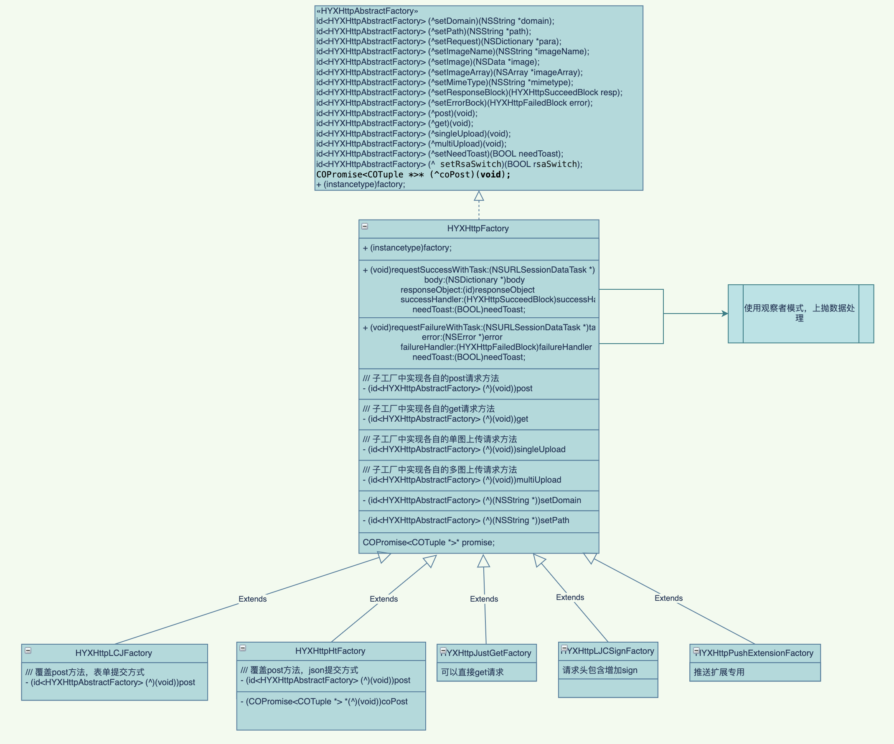

<!--
 * @Author: hfqf123@126.com
 * @Date: 2023-01-09 08:38:46
 * @LastEditors: user.email
 * @LastEditTime: 2023-01-31 19:15:15
 * @FilePath: /design-pattern/app设计规范/软件设计原则(SOLID)/里氏代替原则(LSP)/README.md
 * @Description: 
 * 
 * Copyright (c) 2023 by hfqf123@126.com, All Rights Reserved. 
-->
# 里氏代替原则

### **介绍**
里氏替换原则（Liskov Substitution Principle,LSP）: 任何基类可以出现的地方，子类一定可以出现。

通俗理解：子类可以扩展父类的功能，但不能改变父类原有的功能。换句话说，子类继承父类时，除添加新的方法完成新增功能外，尽量不要重写父类的方法。

### **问题来源**
如果通过重写父类的方法来完成新的功能，这样写起来虽然简单，但是整个继承体系的可复用性会比较差，特别是运用多态比较频繁时，程序运行出错的概率会非常大。

### **关键点**

1、子类可以实现父类的抽象方法，但是不能覆盖父类的非抽象方法

里氏替换原则的关键点在于不能覆盖父类的非抽象方法。父类中凡是已经实现好的方法，实际上是在设定一系列的规范和契约，虽然它不强制要求所有的子类必须遵从这些规范，但是如果子类对这些非抽象方法任意修改，就会对整个继承体系造成破坏。而里氏替换原则就是表达了这一层含义。

2、子类中可以增加自己特有的方法

在继承父类属性和方法的同时，每个子类也都可以有自己的个性，在父类的基础上扩展自己的功能。前面其实已经提到，当功能扩展时，子类尽量不要重写父类的方法，而是另写一个方法

### **实施例子**

该例子中由于存在多种请求方案:表单方式不同、post内容不同、请求头不同等个性化需求，但具体调用方式需要统一风格，采取抽象工厂模式+建造者模式+模版模式，通过子类重写post等方法的方式完成了里氏替换原则的体现。
### **优点**

1.系统稳定，可以保证基础类不被修改。

2.提高代码可扩展性。

### **参与贡献**

1.  hfqf123@126.com
